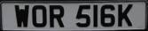
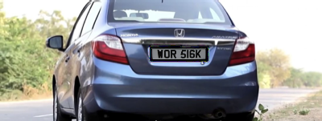

# License Plate Perspective Transformation (車牌透視變換系統)


## Introduction
本專案為線性代數與電腦視覺之實作應用。透過計算 **3x3 透視變換矩陣 (Perspective Transformation Matrix)**，將任意四邊形的車牌影像，精準映射並幾何校正至車輛圖片的指定視角中。

此技術可廣泛應用於圖像校正、擴增實境 (AR) 與影像拼接等領域。

[完整題目](./HW2.pdf)

## Demo
| 輸入：車輛原圖 | 輸入：車牌原圖 | 輸出：透視變換合成結果 |
| :---: | :---: | :---: |
|  |  |  |

## Mathematical Theory
專案核心在於模擬相機的視角變化（距離、位置與角度）。透過影像座標系至像素座標系的離散抽樣處理，我們定義了針對 X、Y、Z 三維空間軸的旋轉矩陣。

例如，當物體繞 Z 軸旋轉 $\theta$ 角度時，其座標變換可由以下旋轉矩陣 $R_z$ 表示：

$$\begin{bmatrix} x \\\\ y \\\\ z \end{bmatrix} = \begin{bmatrix} \cos\theta & -\sin\theta & 0 \\\\ \sin\theta & \cos\theta & 0 \\\\ 0 & 0 & 1 \end{bmatrix} \begin{bmatrix} x' \\\\ y' \\\\ z' \end{bmatrix}$$

同理，系統內部亦實作了針對 X 軸 ($R_x$) 與 Y 軸 ($R_y$) 的旋轉矩陣，以確保車牌在三維空間投影轉換時的精準度。

## Environment
*   **OS:** Ubuntu 22.04
*   **Compiler:** g++ 11.4.0
*   **Library:** OpenCV 4.5.3 (本專案僅使用 OpenCV 進行基礎讀寫，核心數學運算由 C++ 手工實作)

## Usage
編譯完成後，請透過命令列引數傳入三組參數：車輛圖片檔名、車牌圖片檔名，以及預期的輸出檔名。

```bash
# 執行範例
./main car.png plate.png output.png
```

## Source Code
以下為本專案的核心 C++ 實作程式碼。系統透過 OpenCV 讀取影像後，利用形態學與尋找輪廓萃取車牌座標，並動態計算透視變換矩陣。

```cpp
#include <opencv2/opencv.hpp>
#include <iostream>
#include <vector>
using namespace std;
using namespace cv;

int main(int argc, char** argv)
{
    // 讀取圖片
    Mat vehicleImg = imread("C:\\Q5_car.png"/*argv[1]*/);
    Mat plateImg = imread("C:\\Q5_plate.png"/*argv[2]*/);

    // 設定白色範圍
    Scalar lower_white(250, 250, 250); //白色的rbg
    Scalar upper_white(255, 255, 255);

    // 提取白色區域
    Mat white_mask;
    inRange(vehicleImg, lower_white, upper_white, white_mask);
    
    // 進行形態學操作
    Mat dilated_mask;
    dilate(white_mask, dilated_mask, Mat());

    // 找到白色區域的邊界
    vector<vector<Point>> contours;
    findContours(dilated_mask, contours, RETR_EXTERNAL, CHAIN_APPROX_SIMPLE);

    const int edge_margin = 20;
    vector<vector<Point>> filtered_contours;
    for (const auto& contour : contours) {
        Rect bounding_box = boundingRect(contour);
        // 檢查邊界框是否距離邊緣足夠
        if (bounding_box.x > edge_margin &&
            bounding_box.y > edge_margin &&
            bounding_box.x + bounding_box.width < vehicleImg.cols - edge_margin &&
            bounding_box.y + bounding_box.height < vehicleImg.rows - edge_margin) {
            filtered_contours.push_back(contour);
        }
    }
  
    // 找到最大的輪廓
    vector<Point> largest_contour;
    double max_area = 0;
    for (const auto& contour : filtered_contours) {
        double area = contourArea(contour);
        if (area > max_area) {
            max_area = area;
            largest_contour = contour;
        }
    }
    
    drawContours(vehicleImg, vector<vector<Point>>{largest_contour}, -1, Scalar(0, 0, 0), FILLED);

    // 獲取輪廓的凸包
    vector<Point> hull;
    convexHull(largest_contour, hull);

    //將凸包近似為四個頂點
    vector<Point> approx;
    approxPolyDP(hull, approx, arcLength(hull, true) * 0.02, true);

    if (approx.size() == 4) {
        // 根據位置排序四個點
        sort(approx.begin(), approx.end(), [](const Point& a, const Point& b) {
            return a.y < b.y || (a.y == b.y && a.x < b.x);
            });

        // 將四個頂點分成左上、右上、右下和左下
        Point2f top_left, top_right, bottom_left, bottom_right;
        if (approx[0].x < approx[1].x) {
            top_left = approx[0];
            top_right = approx[1];
        }
        else {
            top_left = approx[1];
            top_right = approx[0];
        }

        if (approx[2].x < approx[3].x) {
            bottom_left = approx[2];
            bottom_right = approx[3];
        }
        else {
            bottom_left = approx[3];
            bottom_right = approx[2];
        }

        // 設定動態的目標點
        vector<Point2f> dst_points = { top_left, top_right, bottom_right, bottom_left };

        // 車牌的四個頂點 (左上、右上、右下、左下)
        Point2f src_points[4] = {
            Point2f(0, 0),
            Point2f(plateImg.cols, 0),
            Point2f(plateImg.cols, plateImg.rows),
            Point2f(0, plateImg.rows)
        };

        // 計算透視變換矩陣
        Mat perspective_matrix = getPerspectiveTransform(src_points, dst_points.data());

        // 應用透視變換
        Mat warped_license_plate;
        warpPerspective(plateImg, warped_license_plate, perspective_matrix, vehicleImg.size());

        Mat result;
        vehicleImg.copyTo(result); // 複製原始車輛圖片
        for (int y = 0; y < warped_license_plate.rows; y++) {
            for (int x = 0; x < warped_license_plate.cols; x++) {
                if (warped_license_plate.at<Vec3b>(y, x) != Vec3b(0, 0, 0)) {
                    result.at<Vec3b>(y, x) = warped_license_plate.at<Vec3b>(y, x);
                }
            }
        }
        // 儲存結果
        imwrite("C:\\Users\\acer\\Desktop\\result.png"/*argv[3]*/, result);
    }
    return 0;
}
